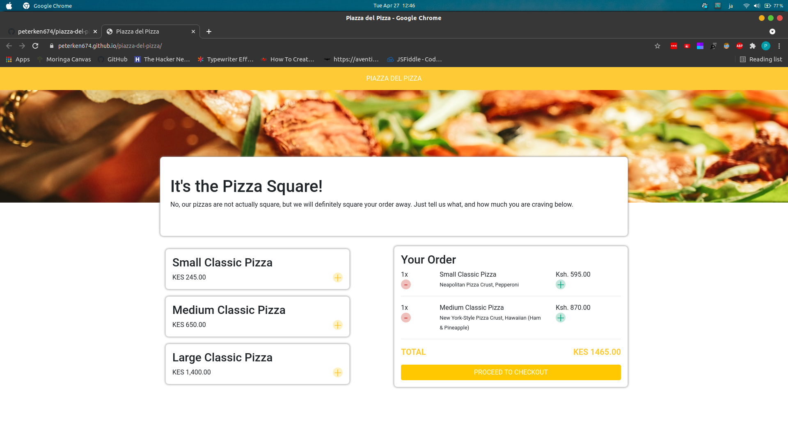

# Piazza del Pizza, 2021
#### By **Peter Kennedy**
## Description
Website for a pizza place where one can place orders and choose either delivery or pickup, then view the total of their order.

## Setup/Installation
To view the website, go to [peterken674.github.io/piazza-del-pizza](https://peterken674.github.io/piazza-del-pizza). 

## Known Bugs
- No knowns bugs so far, but you can reach out if any is observed.
- Not all features of the UI are functional for now.
## Technologies Used
- HTML
- CSS
- Bootstrap 4
- JavaScript
- jQuery
## Support and contact details
If you have any suggestions, questions or in case of a fire, you can reach the developer via [email](mailto:peterken.ngugi@gmail.com).
### License
 

Copyright &copy; 2021 **[peterken674](www.github.com/peterken674)**